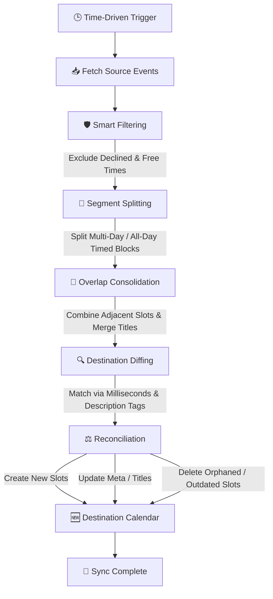

# 📅 **Google Calendar Availability Sync**

A highly robust, privacy-focused Google Apps Script that automatically syncs and consolidates events from multiple source calendars (e.g., Work, Personal, School) into a single **"Availability"** calendar. 

Keep your scheduling systems (like Calendly, Cal.com, or HubSpot) and colleagues perfectly informed of your busy times without exposing any private appointment details.

---

## 📖 **Table of Contents**
1. [✨ Key Features](#-key-features)
2. [🔄 How It Works (Sync Pipeline)](#-how-it-works-sync-pipeline)
3. [🚀 Setup Instructions](#-setup-instructions)
    - [Step 1: Create Your Destination Calendar](#step-1-create-your-destination-calendar)
    - [Step 2: Retrieve Your Calendar IDs](#step-2-retrieve-your-calendar-ids)
    - [Step 3: Create the Google Apps Script Project](#step-3-create-the-google-apps-script-project)
    - [Step 4: Add and Configure the Code](#step-4-add-and-configure-the-code)
    - [Step 5: Set Up the Automation Trigger](#step-5-set-up-the-automation-trigger)
    - [Step 6: Authorize the Script](#step-6-authorize-the-script)
4. [⚙️ Configuration Reference](#️-configuration-reference)
5. [🌐 Sharing Your Availability](#-sharing-your-availability)
    - [Option A: Public Web View](#option-a-public-web-view)
    - [Option B: Secure iCal Subscription](#option-b-secure-ical-subscription)
6. [🛠️ Troubleshooting & Google Quotas](#️-troubleshooting--google-quotas)
7. [🧹 Clean Teardown / Uninstallation](#-clean-teardown--uninstallation)
8. [📄 License](#-license)

---

## ✨ **Key Features**

*   **🔒 Complete Privacy:** Replaces original titles, description notes, and guest lists with custom, generic availability blocks (e.g., "Personal", "Work", "Class") so no private details leak.
*   **🧩 Smart Overlap Consolidation:** Automatically merges overlapping or adjacent events from multiple source calendars into a single, clean block. If a "Work" and "Personal" event overlap, the script titles the destination event `Work & Personal` and details the active sources in the description.
*   **📅 Daily All-Day Splitting:** Automatically converts all-day events and multi-day timed events into individual daily timed segments (`00:00:00` to `23:59:59`). This forces calendar platforms (like Calendly and Cal.com) to block off the entire hourly grid as busy, rather than leaving them as top-banner "all-day" events which are frequently ignored.
*   **🛡️ Smart Filtering:** Automatically ignores invitations you have explicitly declined (`GuestStatus.NO`) or events marked as "Free/Transparent" (such as automatic holiday calendars, birthdays, or casual notes), ensuring only real commitments block your schedule.
*   **🔄 Robust Reconciliation:** Uses precise millisecond epoch value checking and metadata tracking saved within event descriptions to dynamically match events. It detects changes instantly and cleanly wipes out orphaned entries when a source event is deleted or moved.
*   **⏳ Exponential Backoff:** Built-in rate-limit protection automatically retries calendar modifications with randomized jitter when Google's API limits are encountered, optimizing execution speed to under 2 seconds.
*   **🌐 Dynamic Timezone Awareness:** Automatically reads and matches your primary calendar's IANA timezone settings for perfect date boundary transitions.

---

## 🔄 **How It Works (Sync Pipeline)**

The script operates on a robust, state-based reconciliation model rather than simple event copying. This ensures that deletions, modifications, and overlapping slots are dynamically recalculated on every execution.

---

## 🚀 **Setup Instructions**

> [!WARNING]
> **GitHub Security Warning:** Your configured `Code.gs` file will contain your private Google Calendar IDs (which are often your email addresses). **Never upload or commit your configured code to a public GitHub repository.** Add your script path to `.gitignore` or keep configured files in a local-only directory (e.g., `My_Code.gs`).

### **Step 1: Create Your Destination Calendar**
1. Open [Google Calendar](https://calendar.google.com).
2. On the left side, next to **Other calendars**, click **Add other calendars (+)** > **Create new calendar**.
3. Name it something clear like `My Availability` or `Public Schedule`. This will serve as your destination calendar.

### **Step 2: Retrieve Your Calendar IDs**
You need the unique ID of every calendar you want to sync *from* (sources) and write *to* (destination).
1. Hover over a calendar in the left-hand list, click the three vertical dots (**⋮**), and select **Settings and sharing**.
2. Scroll down to the **Integrate calendar** section.
3. Locate and copy the **Calendar ID** (for primary calendars, this is your email address; for custom calendars, it ends in `@group.calendar.google.com`).
4. Keep these IDs handy for configuration.

### **Step 3: Create the Google Apps Script Project**
1. Go to [script.google.com](https://script.google.com) (ensure you are logged into the correct Google account).
2. Click **New project** in the top-left.
3. Click on **Untitled project** at the top and rename it to `Calendar Sync Service`.

### **Step 4: Add and Configure the Code**
1. Delete any boilerplate code inside the Apps Script editor.
2. Copy the entire contents of [Code.gs](file:///c:/Users/adurs/OneDrive/Documents/repos/repos/Personal_Projects/GoogleCalendarSync/Code.gs) (or your local `My_Code.gs`) and paste it into the editor.
3. Customize the parameters at the top of the file under the `// --- CONFIGURATION ---` section using your copied Calendar IDs (see the [Configuration Reference](#️-configuration-reference) below).
4. Click the **Save project** (floppy disk) icon or press `Ctrl + S`.

### **Step 5: Set Up the Automation Trigger**
1. In the left-hand sidebar of the script editor, click the clock icon (**Triggers**).
2. Click the **+ Add Trigger** button in the bottom-right.
3. Configure the trigger with the following settings:
    *   **Function to run:** `processSyncBatch`
    *   **Deployment to run from:** `Head`
    *   **Event source:** `Time-driven`
    *   **Type of time-based trigger:** `Minutes timer`
    *   **Minute interval:** `Every 5 minutes` *(The recommended sweet spot for responsiveness and quota safety)*.
4. Click **Save**.

### **Step 6: Authorize the Script**
1. Upon saving your trigger, Google will display a security pop-up requesting permissions.
2. Select your Google account.
3. You will see a **"Google hasn't verified this app"** screen. Click on **Advanced** at the bottom, then click **Go to Calendar Sync Service (unsafe)** to proceed.
4. Click **Allow** on the permissions screen.

---

## ⚙️ **Configuration Reference**

Modify these constants at the top of your `Code.gs` script to define your sync environment:

| Constant | Data Type | Requirement | Description |
| :--- | :--- | :--- | :--- |
| `SOURCE_CALENDAR_IDS` | `string[]` | **Required** | Array of source Calendar IDs to read events from. |
| `DESTINATION_CALENDAR_ID` | `string` | **Required** | The ID of your separate public/availability calendar. |
| `EVENT_TITLE` | `string` | **Required** | Default fallback title if a source calendar is not listed in `CALENDAR_NAMES` (e.g., `"Busy"`). |
| `CALENDAR_NAMES` | `Object` | *Optional* | Key-value mapping of source IDs to custom titles (e.g., `"Personal"`, `"Work"`, `"Class"`). |
| `SYNC_START_DATE` | `string` | **Required** | Format: `YYYY-MM-DD`. Earliest date to sync during manual full-history runs. |
| `SYNC_TAG` | `string` | **Required** | Unique string key (default: `"sync-id:auto-generated"`) stored in event descriptions to prevent the script from deleting your manually added destination events. |
| `TIMEZONE` | `string` | *Optional* | IANA Timezone ID (e.g., `"America/New_York"`). Leave blank `""` to dynamically inherit your calendar's primary timezone. |
| `SYNC_DAYS_BEFORE` | `number` | **Required** | Number of past days to actively sync on every rolling interval (default: `7`). |
| `SYNC_DAYS_AFTER` | `number` | **Required** | Number of future days to actively sync on every rolling interval (default: `30`). |

---

## 🌐 **Sharing Your Availability**

Once your destination calendar is populated, you can share it with booking services, employers, or clients.

### **Option A: Public Web View**
1. Go to your destination calendar's **Settings and sharing**.
2. Under **Access permissions for events**, check the box next to **Make available to public**.
3. In the warning pop-up, click **OK**.
4. In the dropdown menu, select **See all event details**. *(Since the script automatically masks your private event details, it is safe to show event details).*
5. Scroll down to the **Integrate calendar** section and copy the **Public URL to this calendar** to share.

### **Option B: Secure iCal Subscription**
For coworkers or partners who want to subscribe to your availability directly inside their own calendar client (Outlook, Apple Calendar, or another Google account):
1. In the destination calendar's **Integrate calendar** settings section, locate the **Public address in iCal format** URL.
2. Copy the URL and share it. They can import this link directly into their calendar app to see your availability update in real-time.

---

## 🛠️ **Troubleshooting & Google Quotas**

Google Apps Script runs in a shared cloud environment and is subject to Google's standard developer quotas:

*   **Calendar Permissions Error:** If the execution log displays `Could not access calendar [ID]`, verify that your Google account has permission to view that calendar. If the source calendar was shared from another account, ensure it is set to at least *See all event details*.
*   **Daily Executions Limit:** Running the sync every 5 minutes utilizes roughly 288 executions per day, which sits comfortably within Google's standard consumer quota of 20,000 executions per day.
*   **Quota Limit Warnings:** If you notice API rate-limit errors in the execution log, the script's built-in **Exponential Backoff (`callWithBackoff`)** will automatically pause, sleep, and safely retry the request. No manual intervention is needed.
*   **How to View Logs:**
    1. Go to [script.google.com](https://script.google.com) and open your project.
    2. Click on the **Executions** tab in the left-hand sidebar to inspect timestamps, run states, and log entries.

---

## 🧹 **Clean Teardown / Uninstallation**

If you decide to stop using the sync service and wish to cleanly purge all automatically generated availability events from your destination calendar:

1. In the Google Apps Script project editor, select the **Triggers** tab (clock icon) and delete the time-driven trigger.
2. Temporarily edit your `Code.gs` script: set both `SYNC_DAYS_BEFORE` and `SYNC_DAYS_AFTER` parameters to `0` (or set `SOURCE_CALENDAR_IDS` to an empty array `[]`).
3. Manually execute the `processSyncBatch` function once from the script editor toolbar. The script's reconciliation diff engine will identify all existing synced events as orphaned and cleanly delete them.
4. If you have legacy Script Properties you'd like to wipe out, run the `resetSync` helper function from the top toolbar dropdown.
5. You can now safely delete the Google Apps Script project.

---

## 📄 **License**

This project is licensed under the Apache License 2.0. See the [LICENSE](LICENSE) file for full details.
